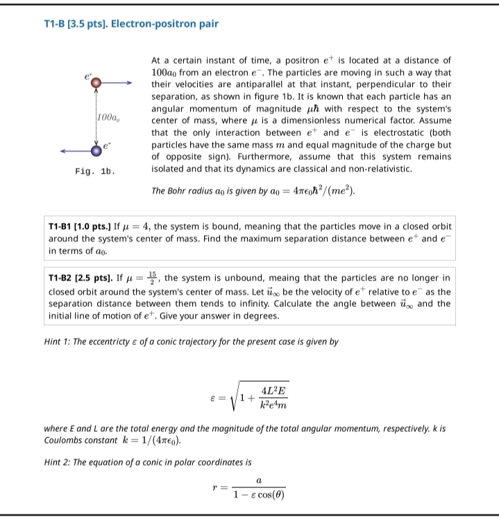

# Problem 001

**Source:** Physics Olympiad — Theory Problem T1-B, "Electron-positron pair"

**Difficulty:** ★★★★☆

**Field / Subfield:** Classical Mechanics — Two-Body Central Force / Coulomb Orbits

**Keywords / Tags:** two-body problem, angular momentum, Coulomb potential, conic orbits, eccentricity, scattering angle

---

## Problem Statement

At a certain instant of time, a positron $e^+$ is located at a distance of $100a_0$ from an electron $e^-$. The particles are moving so that their velocities are antiparallel at that instant, and perpendicular to the line separating them (see figure).

Each particle has angular momentum of magnitude $\mu\hbar$ with respect to the system's center of mass, where $\mu$ is a dimensionless numerical factor. The only interaction between $e^+$ and $e^-$ is electrostatic. Both particles have the same mass $m$ and equal magnitude of charge, but opposite sign. The system is isolated, and its dynamics are classical and non-relativistic.

The Bohr radius is $a_0 = 4\pi\epsilon_0 \hbar^2 / (m e^2)$, and $k = 1/(4\pi\epsilon_0)$.

### Part B1 (1.0 pts)

If $\mu = 4$, the system is bound: the particles move in a closed orbit around the system's center of mass. Find the maximum separation distance between $e^+$ and $e^-$, in terms of $a_0$.

### Part B2 (2.5 pts)

If $\mu = \frac{15}{2}$, the system is unbound: the particles are no longer in a closed orbit. Let $\vec{u}_\infty$ be the velocity of $e^+$ relative to $e^-$ as the separation distance tends to infinity. Calculate the angle between $\vec{u}_\infty$ and the initial line of motion of $e^+$. Give the answer in degrees.

**Hint 1:** The eccentricity $\varepsilon$ of the conic trajectory is

$$
\varepsilon = \sqrt{1 + \frac{4L^2E}{k^2e^4m}}
$$

where $E$ and $L$ are the total energy and total angular momentum of the system.

**Hint 2:** The equation of a conic in polar coordinates is

$$
r = \frac{a}{1 - \varepsilon\cos\theta}
$$

---

## Notes

Scratch work supporting the B1 derivation is included as a second reference image.

